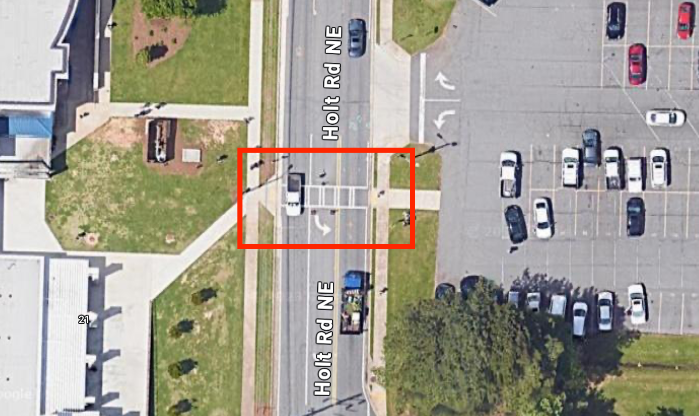
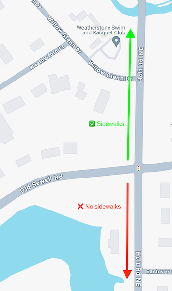
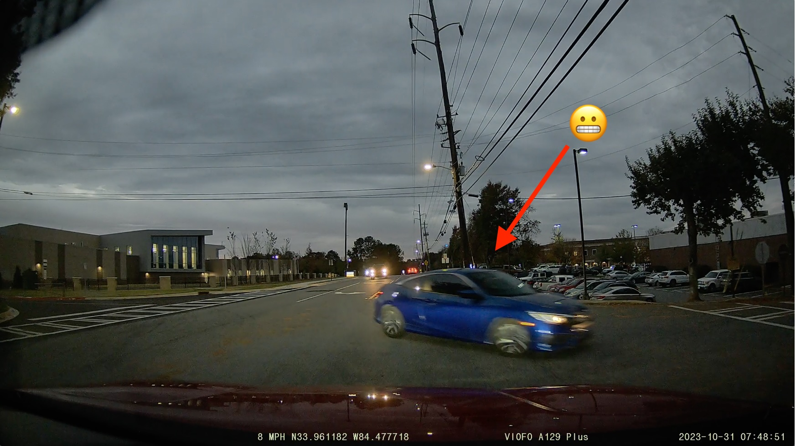

A group of neighbors met at [Marietta Coffee Company](https://mariettacoffeecompany.com)
on November 14, 2023 with the intent to discuss walkability concerns around
Holt Rd.

A few primary themes were brought up organically:

### Crosswalk Efficacy

Several issues were noted highlighting the efficacy of existing crosswalks
along Holt Rd.

- A student was [hit by a bus](https://www.mdjonline.com/news/police_fire/wheeler-high-school-student-struck-by-school-bus/article_3144bec8-43b1-11ee-99ad-d30c2ddc7659.html) earlier in the 2023/2024
school year.  The student was crossing Holt Rd. at a place where there was no
crosswalk, and even if the student had used the existing crosswalk, the crosswalk
itself had been partially broken and inoperable from the West side of Holt.
for weeks prior.  There is conflicting information on if the severity of the
student's injuries.
- Existing crosswalk linking [Wheeler High School](https://cobbk12.org/Wheeler)
with [Eastvalley Elementary](https://cobbk12.org/eastvalley) has two primary
issues:
  - Inconveniently located from where the majority of foot traffic tends to
  cross Holt Rd.

  

  - Even if this crosswalk were conveniently located for foot traffic, the 
  crosswalk has gone through extended (multi-week) periods of inoperability.

- Existing crosswalk at the Holt/Robinson intersection which crosses Robinson Rd.
leads to nowhere, just grass and dirt.  This forces a pedestrian who may be
walking to or from the nearest cross street (Mary Ann Dr.) to make a potentially
dangerous decision:
  - Either opt to not use the crosswalk and cross Robinson Rd. near a blind
  curve, or
  - Walk approx. 230' feet along a grass and dirt embankment.

  

### Sidewalk Continuity

Sidewalk continuity is a problem, particularly along the south end of Holt Rd.
from Sewell Mill Rd. to Lower Roswell Rd.  On this section, sidewalks are 
entirely absent outside of a small section directly in front of the Mormon
Church - which is of course never used as it connects to no other sidewalks.

- Considering the amount of potential pedestrian traffic here, and the amount
of people who walk along this section of Holt Rd. regardless, it would seem
appropriate that sidewalks would be continued.

- Sidewalks for the south end of Holt Rd. were noted in the 2016 SPLOST initiative,
but never seceived funding. [Source](https://s3.us-west-2.amazonaws.com/cobbcounty.org.if-us-west-2/prod/2022-08/2016-SPLOST-Status-08-03-2022.pdf)

### Sidewalk Repair

Areas of existing sidewalks along Holt Rd. are in need of obvious repair and
present a risk of injury to pedestrians.  While bicycling on sidewalks is 
technically against the law, it still occurs for those moving at low speeds, and 
the current state of sidewalk repair in some areas presents a risk of injury 
here as well.

### Imaginary Stop Signs

The carpool line feeding into the access road on the North side of the Wheeler
High School campus presents a curious phenomenon in the mornings.  Cars
traveling south on Holt Rd. seem to stop, in the middle of a moving traffic lane,
to let cars turning left into the access road turn.

There is no stop sign here, and cars traveling along Holt Rd. are under no 
obligation to stop for left-turning traffic.  Despite this, an "imaginary stop 
sign" seems to appear, where this intersection ends up being treated like a
4-way stop despite no signage.

This is dangerous.  A car properly obeying the rules of the road and moving
through the intersection is at risk of a head-on collision from a left-turning
vehicle making an improper assumption that the oncoming car is going to stop
for them.

### Next Steps

Next steps from this meeting will include:

- Additional communication with te Cobb BOC (particularly [Jerica Richardson](https://www.cobbcounty.org/board/district-commissioners/district-2-commissioner),the present District 2 commissioner as of the time this 
post was written).
- Addiitonal community communication (email, web, social?)
- Identifying community outreach (walk feasibility study, walk-to-school event,
etc.)
- Forming Holt Road Alliance as a non-profit.

If you have any experience with these issues, or are a concerned neighbor in
the area, we would love to speak with you.  Please leverage the form on the
[Contact Us]( "Contact Us") page.